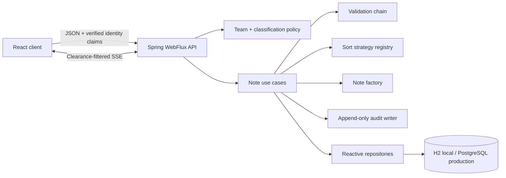
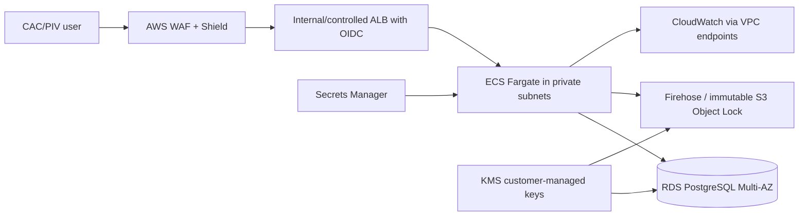

# Mission Notes

A secure-by-design note collaboration service for mission teams.

This coding-challenge submission is tailored to the public themes in Bluestaq's work: defense-grade data infrastructure, discoverability, data mobility, interoperability, and operation in high-consequence environments. It is an independent demo and **does not claim Bluestaq affiliation, FedRAMP authorization, CMMC certification, DoD Impact Level approval, or authorization to process classified information**.

- **Backend:** Java 21, Spring Boot 4, WebFlux, Spring Data R2DBC
- **Frontend:** React 19, TypeScript, Vite
- **Local database:** in-memory H2 for zero-setup review
- **Production target:** PostgreSQL on AWS
- **Realtime updates:** Server-Sent Events (SSE)

## Mission scenario

Small government and defense teams need to capture decisions without losing control of who can discover or change the information. Mission Notes provides:

- Team-scoped create, read, update, archive, restore, and delete
- Server-enforced markings: `PUBLIC`, `INTERNAL`, and `CUI`
- Clearance-filtered search, reads, writes, and realtime events
- Append-only mutation audit records
- Optimistic locking to prevent silent overwrite of another operator's edit
- Standard Problem Details error responses
- No-store and browser-hardening response headers
- Request IDs for trace correlation

`CUI` in this project is a functional demonstration of access-control behavior—not a statement that the application meets the controls required to handle real CUI.

## Run locally

### Development mode

Requirements: Java 21+ and Node.js 22+.

Terminal 1:

```powershell
cd backend
.\mvnw.cmd spring-boot:run
```

Terminal 2:

```bash
cd frontend
npm install
npm run dev
```

Open http://localhost:5173. The API runs at http://localhost:8080.

The default profile uses in-memory H2, so local data resets when the backend restarts.

### Docker Compose

Requirements: Docker Desktop.

```bash
docker compose up --build
```

Open http://localhost:3000. Compose uses PostgreSQL and a persistent named volume.

## Test and build

```bash
cd backend
./mvnw test

cd ../frontend
npm install
npm run lint
npm run build
```

The integration suite exercises the real HTTP API and database. It covers CRUD, team isolation, validation, duplicate titles, archive/delete, stale-edit conflicts, audit creation, and classification enforcement.

GitHub Actions runs both the backend integration suite and frontend lint/build on pushes to `main` and on pull requests.

## Demo identity boundary

REST calls require:

- `X-User-Id`: simulated authenticated subject
- `X-User-Clearance`: `PUBLIC`, `INTERNAL`, or `CUI`

These headers make the authorization behavior easy to demonstrate locally. They are **not a production authentication mechanism** because a client can spoof them.

In production, an ALB/API gateway would validate a signed JWT issued by an approved agency identity provider (for example CAC/PIV-backed OIDC). A trusted gateway would remove inbound identity headers and inject verified claims. The service would accept traffic only from that gateway's security group.

Native browser `EventSource` cannot set authorization headers, so the demo SSE route accepts identity values as query parameters. Production would use same-origin secure cookies, a fetch-based event stream with an `Authorization` header, or a short-lived one-time stream token. Long-lived credentials must never be placed in URLs.

## API

All routes are scoped to a team:

| Method | Route | Purpose |
| --- | --- | --- |
| `GET` | `/api/teams/{teamId}/notes` | List/search/filter/sort accessible notes |
| `GET` | `/api/teams/{teamId}/notes/{id}` | Read one accessible note |
| `POST` | `/api/teams/{teamId}/notes` | Create at or below caller clearance |
| `PUT` | `/api/teams/{teamId}/notes/{id}` | Replace editable fields |
| `PATCH` | `/api/teams/{teamId}/notes/{id}/archive?archived=true` | Archive or restore |
| `DELETE` | `/api/teams/{teamId}/notes/{id}` | Permanently delete |
| `GET` | `/api/teams/{teamId}/notes/events` | Clearance-filtered SSE stream |
| `GET` | `/api/teams/{teamId}/audit` | Mutation audit trail; demo requires CUI clearance |

List parameters:

- `query`: case-insensitive title/content search
- `status`: `ACTIVE` or `ARCHIVED`
- `sort`: `UPDATED_DESC`, `CREATED_DESC`, or `TITLE_ASC`

Create a controlled note:

```bash
curl -X POST http://localhost:8080/api/teams/orbital-ops/notes \
  -H "Content-Type: application/json" \
  -H "X-User-Id: operator.ada" \
  -H "X-User-Clearance: CUI" \
  -d '{
    "title":"Sensor integration decision",
    "content":"Capture approved interfaces and next actions.",
    "classification":"CUI"
  }'
```

Updates include the last version seen by the client:

```json
{
  "title": "Sensor integration decision",
  "content": "Approved interface details.",
  "version": 0
}
```

A stale version returns `409 Conflict`; the service never retries a destructive overwrite automatically.

An inaccessible note returns `404`, not `403`, to avoid confirming that the record exists.

## Architecture



### Reactive/threading model

WebFlux and R2DBC keep processing non-blocking from HTTP socket to database socket. A small event-loop pool can serve many concurrent connections while they wait on I/O. The code deliberately does not create manual threads inside request paths; manual executors would complicate context propagation and can undermine WebFlux's event-loop model.

SSE demonstrates long-lived streaming. Both ordinary reads and events apply the same classification predicate, preventing a common side-channel where normal endpoints are protected but notifications leak restricted metadata.

## Security model

### Enforced in this demo

- Team scope is present in every repository lookup.
- The API derives note authorship from the request actor, never from request content.
- Callers cannot create or discover data above their clearance.
- Inaccessible IDs return `404` to reduce existence disclosure.
- All mutations produce audit records containing actor, action, note ID, team, marking, and timestamp.
- Optimistic locking detects concurrent edits.
- Responses set `Cache-Control: no-store`, `X-Content-Type-Options`, `X-Frame-Options`, `Referrer-Policy`, CSP, and a request ID.
- Validation constrains identity, title, content, team ID, and enum inputs.
- CORS origins are configuration, not wildcard production defaults.
- Secrets and generated artifacts are excluded from Git.

### Required before handling real sensitive data

- Replace demo headers with cryptographically verified CAC/PIV/OIDC identity.
- Add membership/role policy (ABAC/RBAC), including write/delete separation of duties.
- Enforce tenant and classification policy in PostgreSQL Row-Level Security as defense in depth.
- Use approved encryption, key ownership, rotation, and FIPS endpoints where required.
- Move audit events to immutable, separately administered storage with retention/legal-hold policy.
- Add malware/content inspection, data-loss prevention, egress controls, and upload controls.
- Define data retention, records management, incident response, backup restoration, and account offboarding.
- Complete threat modeling, SAST/SCA/container scanning, penetration testing, and an authorization process against the applicable control baseline.

## Design choices that took the most thought

### 1. Authorization as a data-plane concern

Team and marking checks are applied in the service for list, item read, update, archive, delete, and event streaming. This makes policy behavior consistent across protocols.

Tradeoff: records are currently fetched by team and then classification-filtered in the application. That is simple and testable for the challenge. At scale, queries should include allowed classifications and PostgreSQL RLS should provide an independent enforcement layer.

### 2. Honest end-to-end reactive I/O

I chose WebFlux **with R2DBC**, not WebFlux over blocking JPA. Blocking database calls on Netty event-loop threads can collapse throughput and provide reactive complexity without reactive benefits.

Tradeoff: Spring MVC + JPA is easier to operate and is a better default for ordinary low-traffic CRUD. WebFlux is justified here by concurrent realtime streams and the challenge's explicit interest in reactive/threading design.

### 3. Auditability and concurrency over silent convenience

Mutations write an audit record and stale edits fail with `409`. The client surfaces conflicts rather than auto-retrying, because an automatic retry might overwrite a teammate's newer mission context.

Tradeoff: this is an application audit log, not yet a tamper-evident compliance ledger. Production events should be exported asynchronously to immutable storage in a separate security boundary.

## Design patterns used

Patterns are used only where they create a useful extension point.

| Pattern | Implementation | Purpose |
| --- | --- | --- |
| Factory (creational) | `NoteFactory` | Normalized creation, timestamps, defaults, markings |
| Strategy | `NoteSortStrategy` implementations | Add sort policies without branching in the service |
| Chain of Responsibility | ordered `NoteRule` implementations | Compose synchronous and reactive business validation |
| Repository | note and audit repositories | Isolate persistence from use cases |
| Observer / Publisher-Subscriber | Reactor sink + SSE | Notify open team workspaces without polling |
| Dependency Injection | Spring constructor injection | Explicit, replaceable dependencies |

I did not add Builder, Abstract Factory, Command, Visitor, or manual Singleton patterns because they do not solve a present requirement. Spring already owns component lifecycle, and Java records make DTO builders unnecessary. A reviewer should not have to navigate decorative abstractions.

## AWS deployment for a government workload

The target account/partition depends on the actual contract and data category. If AWS GovCloud (US) is required, every selected service and integration must be verified for the target region and authorization boundary.



Recommended controls:

1. Separate AWS accounts for workload, security tooling, and immutable logs under AWS Organizations.
2. No public ECS tasks or database; use private subnets, restrictive security groups, VPC endpoints, and controlled egress.
3. ALB OIDC federation to an approved identity provider; map signed group/clearance claims to application policy.
4. RDS PostgreSQL Multi-AZ with KMS customer-managed encryption, TLS enforcement, automated backups, and tested restore procedures.
5. ECR image scanning, pinned base-image digests, SBOM generation, signed images, and deployment policy checks.
6. CloudTrail organization trails, AWS Config, GuardDuty, Security Hub, WAF logging, and centralized CloudWatch alarms.
7. Export application audit events to Object Lock storage with a separate administrator and retention policy.
8. Run at least two Fargate tasks across availability zones; use readiness checks and controlled rolling deployments.
9. Provision with Terraform/CDK and require peer review plus automated security/evaluation gates.

Security controls support compliance, but architecture diagrams and AWS services do not confer compliance by themselves.

## What I would change with more time

- Implement real JWT validation and team membership/role claims
- Add PostgreSQL RLS and database roles for defense in depth
- Replace schema initialization with signed, versioned Flyway migrations
- Push search/sorting/pagination into PostgreSQL and add full-text search
- Replace the in-process event sink with a durable multi-instance event backbone
- Add OpenTelemetry with strict content redaction
- Add immutable audit export and integrity verification
- Add frontend component tests, Playwright journeys, DAST, SAST, dependency and container scanning
- Add Terraform plus signed artifact promotion across isolated environments
- Conduct a misuse-case threat model and document control inheritance/shared responsibility

## Scope assumptions

- A note belongs to one team and has one immutable marking.
- Markings cannot be downgraded through the current API.
- Any sufficiently cleared team member can currently edit/archive/delete; production needs role policy.
- Deletion is permanent; archive is reversible.
- Titles are unique per team, case-insensitively.
- Search is substring matching for this small-team exercise.
- H2 optimizes reviewer convenience; PostgreSQL is the production target.
